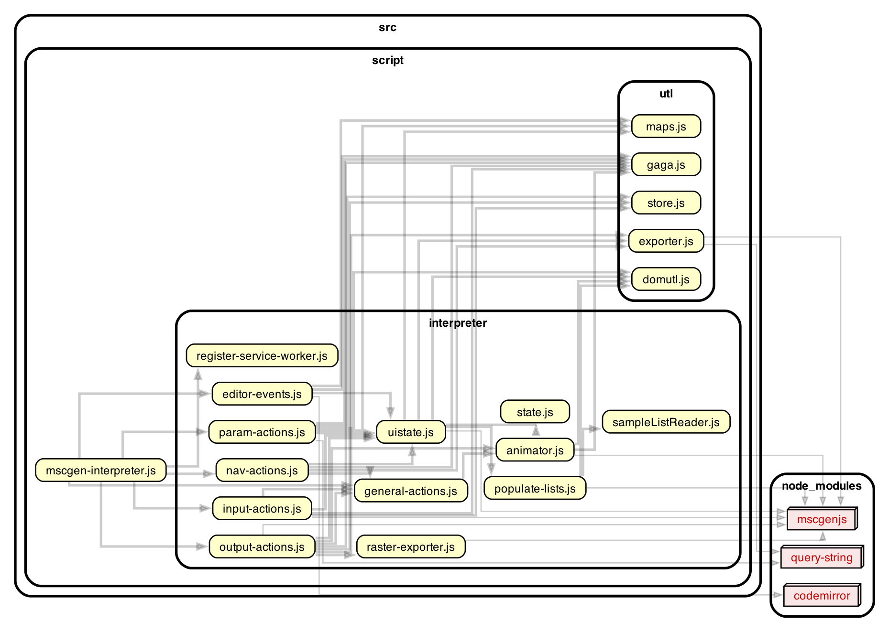

### Dependency graph

As you can see here the site code is fairly lightweight and heavily depends
on the mscgen.js library for rendering and codemirror for the editor:

(Graph generated with [dependency-cruiser](https://github.com/sverweij/dependency-cruiser))