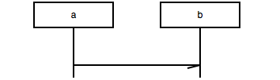
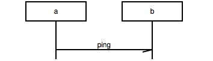
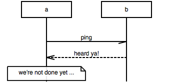
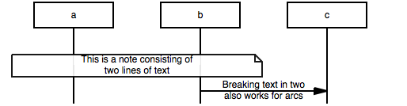
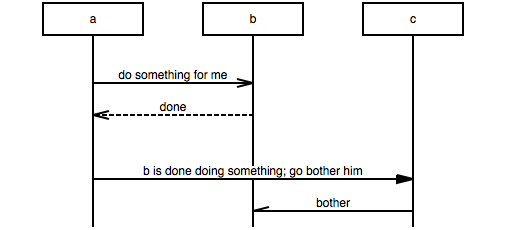
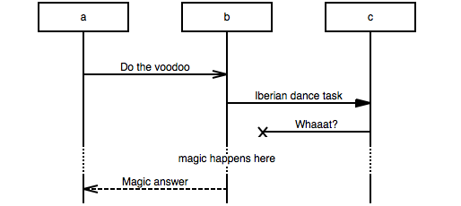
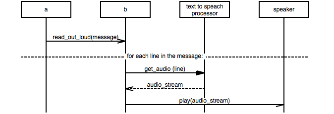

# Tutorial

- [Basics](#basics)
  - [a sends a signal to b](#signal)
  - [adding text](#text)
  - [b replies to a](#reply)
  - [notes](#note)
  - [multiline text](#multiline)
  - [empty rows, omitted rows, comments](#wholerow)
  - [ignore this](#ignore)
- Advanced stuff
  - options: arcgradient, hscale, width
  - naming entities, explicit order
  - both ways, no way
  - box, rbox, abox
  - broadcasts, parallel calls

<h2 id="basics">Basics</h2>
<h3 id="signal">a sends a signal to b</h3>
``` msgenny
a -> b;
```


As you can see this creates two entities (a and b), both with a lifeline, and an arrow from the first to the second lifeline. 

<h3 id="text">padding text</h3>
To show what , add the text after a colon, like so:

``` msgenny
a -> b: "ping";
```



Note: when your description doesn't contain a , or a ; it is possible to leave the quotes out, so 
``` msgenny
a -> b: ping;
```
achieves the same.

<h3 id="reply">b replies to a</h3>
This works the same, as  
``` msgenny
a -> b: ping;
b >> a: heard ya!;
```


<h3 id="note">notes </h3>
``` msgenny
a -> b: ping;
b >> a: heard ya!;
a note a: we're not done yet ...;
```


<h3 id="multiline">multi line text</h3>
``` msgenny
a note b: This is a note consisting of\ntwo lines of text;
b => c: Breaking text in two\nalso works for arcs;
```


<h3 id="wholerow">empty rows, omitted rows, comments</h3>
Sometimes your chart needs some more space between arcs, e.g. to emphasise grouping. 
``` msgenny
a =>> b: do something for me;
b >> a: done;
|||;
a => c: "b is done doing something; go bother him"; 
c -> b: bother;
```



To indicate you deliberately left out stuff of your chart, you can use ellipses, like this:
``` msgenny
a =>> b: Do the voodoo;
b => c: Iberian dance task;
c -x b: Whaaat?;
...: magic happens here;
b >> a: Magic answer;
```



To demarcate more strongly and/ or to comment on a part, use *comment* (---), like so:
``` msgenny
a =>> b: read_out_loud(message);
---: for each line in the message:;
b => "text to speach\nprocessor": get_audio (line);
"text to speach\nprocessor" >> b: audio_stream;
b -> speaker: play(audio_stream);
```


<h3 id="ignore">ignore this</h3>
In your program lines starting with # or // are ignored, as is everything between c-style block comments
``` msgenny
# This line is ignored
a =>> b: what's happening here? ; /* honestly don't know */
// ignored line
```
Caveat: on translating to mcgen all ignorable text get lost.


<h2 id="advanced">Advanced stuff</h2>
### options: arcgradient, hscale, width
### naming entities, explicit order
### both ways, no way
### box, rbox, abox
### broadcasts, parallel calls

### using the on line demo
By default renders as you type.

saving as svg (includes your program!), png, jpeg

Drag'n drop

Auto render

Language switch.

Help

## mscgen
Click!
Why? 
- mscgen compatibility, 
- doxygen integration. 
- Features: coloring, arcskip, hyperlinks

### coloring
textcolor, textbgcolor, linecolor

### coloring everyting departing from a lifeline
### arcskip
### id, url, idurl
