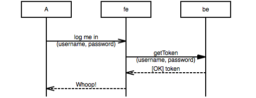

# Tutorial

- [Basics](#basics)
  - [a sends a signal to b](#a-sends-a-signal-to-b)
  - [adding text](#adding-text)
  - [b replies to a](#b-replies-to-a)
  - [notes](#notes)
  - [multiline text](#multiline-text)
  - [empty rows, omitted rows, comments](#empty-rows-omitted-rows-comments)
  - [ignore this](#ignore-this)
- [Advanced stuff](#advanced-stuff)
  - [options: arcgradient, hscale, width](#options-arcgradient-hscale-width)
  - [naming entities, explicit order](#naming-entities-explicit-order)
  - [broadcasts, parallel calls](#broadcasts-parallel-calls)  
  - [both ways, no way](#both-ways-no-way)
  - [box, rbox, abox](#box-rbox-abox)
  

## Basics
### a sends a signal to b
``` msgenny
a -> b;
```


As you can see this creates two entities (a and b), both with a lifeline, and an arrow from the first to the second lifeline. 

### padding text
To show what , add the text after a colon, like so:

``` msgenny
a -> b: "ping";
```


Note: when your description doesn't contain a , or a ; it is possible to leave the quotes out, so 
``` msgenny
a -> b: ping;
```
achieves the same.

### b replies to a
This works the same, as  
``` msgenny
a -> b: ping;
b >> a: heard ya!;
```


### notes
``` msgenny
a -> b: ping;
b >> a: heard ya!;
a note a: we're not done yet ...;
```


### multi line text
``` msgenny
a note b: This is a note consisting of\ntwo lines of text;
b => c: Breaking text in two\nalso works for arcs;
```


### empty rows, omitted rows, comments
Sometimes your chart needs some more space between arcs, e.g. to emphasise grouping. 
``` msgenny
a =>> b: do something for me;
b >> a: done;
|||;
a => c: "b is done doing something; go bother him"; 
c -> b: bother;
```


To indicate you deliberately left out stuff of your chart, you can use ellipses, like this:
``` msgenny
a =>> b: Do the voodoo;
b => c: Iberian dance task;
c -x b: Whaaat?;
...: magic happens here;
b >> a: Magic answer;
```


To demarcate more strongly and/ or to comment on a part, use *comment* (---), like so:
``` msgenny
a =>> b: read_out_loud(message);
---: for each line in the message:;
b => "text to speach\nprocessor": get_audio (line);
"text to speach\nprocessor" >> b: audio_stream;
b -> speaker: play(audio_stream);
```


### ignore this
In your program lines starting with # or // are ignored, as is everything between c-style block comments
``` msgenny
# This line is ignored
a =>> b: what's happening here? ; /* honestly don't know */
// ignored line
```
Caveat: on translating to mcgen all ignorable text get lost.


## Advanced stuff
### options: arcgradient, hscale, width
With *arcgradient* all lines get skewed a little. 
Options go on top
``` msgenny
arcgradient="20";

client => server : SYN;
server => client : SYN + ACK;
client => server : ACK;
```


*hscale* stretches the chart a bit. 
``` msgenny
arcgradient="20", hscale="1.337";

client => server : SYN;
server => client : SYN + ACK;
client => server : ACK;
```


... and *width* scales the whole chart so it fits in exactly the amount of pixels width. 
``` msgenny
arcgradient="20", hscale="1.337", width="314";

client => server : SYN;
server => client : SYN + ACK;
client => server : ACK;
```


### naming entities, explicit order
``` msgenny
A =>> fe: "log me in\n(username, password)";
fe => be: "getToken\n(username, password)";
fe << be: [OK] token;
A << fe: Whoop!;
```


``` msgenny
A: Actor, fe:Front end, be: Back end;

A =>> fe: "log me in\n(username, password)";
fe => be: "getToken\n(username, password)";
fe << be: [OK] token;
A << fe: Whoop!;
```


``` msgenny
1 =>> 4;
3 >> 2;
```


``` msgenny
1,2,3,4;

1 =>> 4;
3 >> 2;
```


### broadcasts, parallel calls
``` msgenny
arcgradient="20";
a, b, c, d;
b =>> *;
```


``` msgenny
a, b, c, d, n;
a => b: parallel with c => d,
 c => d: parallel with a => b, 
 n note n: a note on the same line;
```


### both ways, no way


### box, rbox, abox


### using the on line demo
By default renders as you type.

saving as svg (includes your program!), png, jpeg

Drag'n drop

Auto render

Language switch.

Help

## mscgen
Click!
Why? 
- mscgen compatibility, 
- doxygen integration. 
- Features: coloring, arcskip, hyperlinks

### coloring
textcolor, textbgcolor, linecolor

### coloring everyting departing from a lifeline
### arcskip
### id, url, idurl
