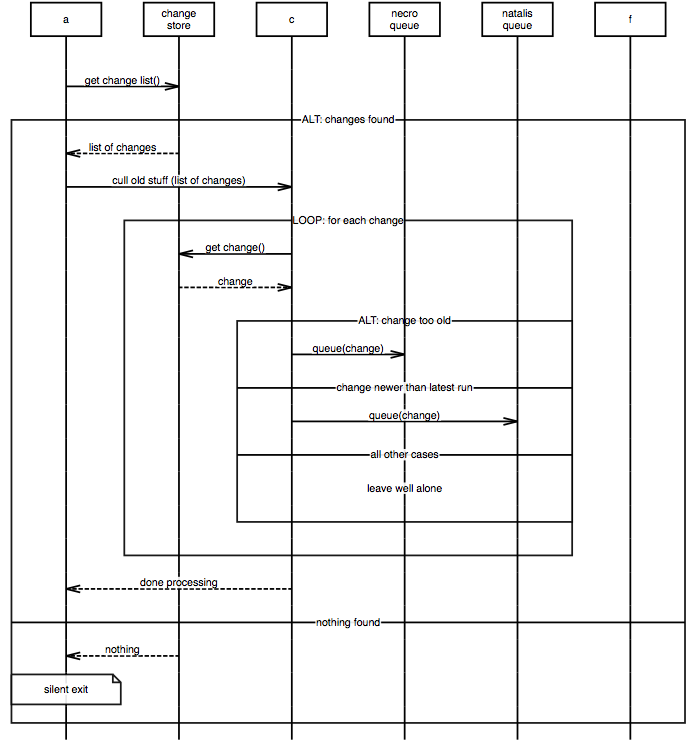

# Xù - an MscGen super set
_**It is MscGen, but not as we know it**_

## Inline expressions
[SDL][2] has a feature called _inline expressions_. They allow you to group a bunch of
arcs and label them somehow. To define a loop, for instance. Or a conditional statement.

[UML2][3] sequence diagrams have a similar concept called "combined fragments" (see
paragraph 14.3.3 of the linked document for details).

Behaviour specification is not a particularly strong suit of interaction diagrams
(sequence charts/ diagrams/ collaboration diagrams), as Martin Fowler
correctly notes in [UML distilled][1]. At this time (November 2015) MscGen does not
support them.

Nonetheless inline expressions are damn handy. Hence Xù - a superset
of MscGen that includes them.

## An example
This is an example of a Xù script describing an interaction that loops over
a list of changes and sorts the old ones to a deletion queue, and the
rest to a birth queue:

```xu
msc {
  width=700, hscale=0.8;
  a, b [label="change store"], c, d [label="necro queue"],
  e [label="natalis queue"];

  a =>> b [label="get change list()"];
  a alt e [label="changes found"] {
    b >> a [label="list of changes"];
    a =>> c [label="cull old stuff (list of changes)"];
    b loop e [label="for each change"] {
      c =>> b [label="get change()"];
      b >> c [label="change"];
      c alt e [label="change too old"] {
        c =>> d [label="queue(change)"];
        --- [label="change newer than latest run"];
        c =>> e [label="queue(change)"];
        --- [label="all other cases"];
        ||| [label="leave well alone"];
      };
    };
    c >> a [label="done processing"];
    --- [label="nothing found"];
    b >> a [label="nothing"];
    a note a [label="silent exit"];
  };
}
```

Rendered (e.g. with the [online interpreter](https://sverweij.github.io/mscgen_js/index.html?utm_source=wikum.xu&lang=xu&msc=msc%20{%0A%20%20width%3D700%2C%20hscale%3D0.8%3B%0A%20%20a%2C%20b%20[label%3D%22change%20store%22]%2C%20c%2C%20d%20[label%3D%22necro%20queue%22]%2C%0A%20%20e%20[label%3D%22natalis%20queue%22]%3B%0A%0A%20%20a%20%3D%3E%3E%20b%20[label%3D%22get%20change%20list%28%29%22]%3B%0A%20%20a%20alt%20e%20[label%3D%22changes%20found%22]%20{%0A%20%20%20%20b%20%3E%3E%20a%20[label%3D%22list%20of%20changes%22]%3B%0A%20%20%20%20a%20%3D%3E%3E%20c%20[label%3D%22cull%20old%20stuff%20%28list%20of%20changes%29%22]%3B%0A%20%20%20%20b%20loop%20e%20[label%3D%22for%20each%20change%22]%20{%0A%20%20%20%20%20%20c%20%3D%3E%3E%20b%20[label%3D%22get%20change%28%29%22]%3B%0A%20%20%20%20%20%20b%20%3E%3E%20c%20[label%3D%22change%22]%3B%0A%20%20%20%20%20%20c%20alt%20e%20[label%3D%22change%20too%20old%22]%20{%0A%20%20%20%20%20%20%20%20c%20%3D%3E%3E%20d%20[label%3D%22queue%28change%29%22]%3B%0A%20%20%20%20%20%20%20%20---%20[label%3D%22change%20newer%20than%20latest%20run%22]%3B%0A%20%20%20%20%20%20%20%20c%20%3D%3E%3E%20e%20[label%3D%22queue%28change%29%22]%3B%0A%20%20%20%20%20%20%20%20---%20[label%3D%22all%20other%20cases%22]%3B%0A%20%20%20%20%20%20%20%20|||%20[label%3D%22leave%20well%20alone%22]%3B%0A%20%20%20%20%20%20}%3B%0A%20%20%20%20}%3B%0A%20%20%20%20c%20%3E%3E%20a%20[label%3D%22done%20processing%22]%3B%0A%20%20%20%20---%20[label%3D%22nothing%20found%22]%3B%0A%20%20%20%20b%20%3E%3E%20a%20[label%3D%22nothing%22]%3B%0A%20%20%20%20a%20note%20a%20[label%3D%22silent%20exit%22]%3B%0A%20%20}%3B%0A}) ) this looks like so:



## Syntax

### Inline expression syntax
As you can see, the syntax of the inline expressions is very similar to that
of regular arcs, the only difference being that inline expressions have a
section of arcs, enclosed by curly brackets.

```pegjs
spanarc         =
 _ from:identifier _ kind:spanarctoken _ to:identifier _ al:("[" al:attributelist "]" {return al})? _ "{" _ arclist:arclist _ "}" _ ";"
```

To compare, this is how a regular arc looks:
```pegjs
regulararc      =
_ from:identifier _ kind:arctoken      _ to:identifier _                       ("[" attributelist "]")? _ ";"
```

Some more examples
```xu
break {
   a => b [label="Can you do this?"];
   b >> a [label="Fatal error"];
};
```

Arguments go into the label as free text.
```xu
loop [label="for each grain of sand on the beach"] {
  a => beach [label="get grain"];
  a => progeny [label="add"];
};
```

```xu
msc {
  john, shed,  bike;

  john alt bike [label="wheather is nice"] {
    john =>> shed [label="get(bike)"];
    shed >> john [label="bike"];
    john =>> bike [label="use"];
    --- [label="else"];
    ||| [label="john stays at home"];
  };
}
```

To separate sections to execute in parallel you can use a comment line, like so:
```xu
par {
  a => b;
  b >> a;
  ---;
  a => c;
  c => d;
}
```

If you're interested in the complete grammar: the parsing expression grammar we
use to generate the parser is [included in the source][4].

### start token
MscGen uses `msc` as a start token. As Xù was designed as an extension
to MscGen the same goes for Xù. If you want to be expressly clear your
script is a Xù script you can also use that:
```xu
xu {
  arcgradient=20;

  a,b,c;

  a par c [label="Saying hello"] {
    a =>> * [label="hi"];
    ---;
    b =>> * [label="hi"];
    ---;
    c =>> * [label="hi"];
  };
  a aboxc [label="Now we know each other a bit"];
}
```

### watermark
Just like msgenny, Xù supports a "watermark" _option_: ```watermark="xù rocks!"```; that puts a watermark diagonally on the rendered chart.


## MsGenny
[MsGenny](./msgenny.md) also has support for inline expressions, the if-then-else construct above
would look something like this:

```msgenny
john, shed, bike;

john alt bike: weather is nice {
  john =>> shed : get(bike);
  shed >> john : bike;
  john =>> bike : use;
  --- : else;
  ||| : john stays at home;
};
```

## translating back to MscGen
- The [command line interface][5] handles by translating inline expressions to horizontal lines ("---")
```sh
# translate Xù back to MscGen
mscgen_js --output-type mscgen --input-fron funkyInlineThings.xu --output-to funkyFlattenedInlineThings.mscgen
```
- The on line interpreter, in debug mode, has an _Export this chart to Vanilla MscGen_ option behind the `...` button. - e.g. for the [Johnny, bike, shed example](https://sverweij.github.io/mscgen_js//index.html?lang=xu&debug=true&msc=msc%20{%0A%20%20john%2C%0A%20%20shed%2C%0A%20%20bike%3B%0A%0A%20%20john%20alt%20bike%20[label%3D%22weather%20is%20nice%22]%20{%0A%20%20%20%20john%20%3D%3E%3E%20shed%20[label%3D%22get%28bike%29%22]%3B%0A%20%20%20%20shed%20%3E%3E%20john%20[label%3D%22bike%22]%3B%0A%20%20%20%20john%20%3D%3E%3E%20bike%20[label%3D%22use%22]%3B%0A%20%20%20%20---%20[label%3D%22else%22]%3B%0A%20%20%20%20|||%20[label%3D%22john%20stays%20at%20home%22]%3B%0A%20%20}%3B%0A})


To start the interpreter in debug mode, pass `debug=true` to the url:
[https://sverweij.github.io/mscgen_js/index.html?debug=true](https://sverweij.github.io/mscgen_js/index.html?debug=true)

## Supported inline expressions

<table>
    <tr><th>feature</th><th>SDL-RT 2.3 inline expression</th><th>UML 2 combined fragment</th><th>xù</th></tr>
    <tr>
        <td>Alternatives - if with an optional else</td>
        <td>alt</td>
        <td>alt, else</td>
        <td><code>alt</code></td>
    </tr>
    <tr>
        <td>Alternatives - if with noelse</td>
        <td>opt</td>
        <td>opt</td>
        <td><code>opt</code></td>
    </tr>
    <tr>
        <td>Break - an exception occurred. After this nothing happens.</td>
        <td>exc</td>
        <td>break</td>
        <td><code>exc</code><br>
        <code>break</code>
        </td>
    </tr>
    <tr>
        <td>Parralel - do several things at once</td>
        <td>par</td>
        <td>par</td>
        <td><code>par</code></td>
    </tr>
    <tr>
        <td>Weak sequencing - stuff within here can happen in any order across the instances</td>
        <td>seq</td>
        <td>seq</td>
        <td><code>seq</code></td>
    </tr>
    <tr>
        <td>Strict sequencing - stuff within here can happen in only this order across the instances</td>
        <td>_not available_</td>
        <td>strict</td>
        <td><code>strict</td>
    </tr>
    <tr>
        <td>Negative - this is not happening</td>
        <td>_not available_</td>
        <td>neg</td>
        <td><code>neg</code></td>
    </tr>
    <tr>
        <td>Critical region - this is important, execute at once</td>
        <td>_not available_</td>
        <td>critical</td>
        <td><code>critical</code></td>
    </tr>
    <tr>
        <td>Ignore/ consider</td>
        <td>_not available_</td>
        <td>ignore, consider</td>
        <td><code>consider</code><br>
        <code>ignore<code>
        </td>
    </tr>
    <tr>
        <td>Assertion - this stuff must be true</td>
        <td>_not available_</td>
        <td>assert</td>
        <td><code>assert</code></td>
    </tr>
    <tr>
        <td>Loop - repeat this</td>
        <td>loop</td>
        <td>loop</td>
        <td><code>loop</code></td>
    </tr>
    <tr>
        <td>Reference - it's not here, but there's a diagram somewhere else detailing this</td>
        <td>not available as an "inline expression" but as 'MSC reference'</td>
        <td>_not available_</td>
        <td><code>ref</code></td>
    </tr>
</table>


[1]: http://my.safaribooksonline.com/book/software-engineering-and-development/uml/0321193687/sequence-diagrams/ch04lev1sec4
[2]: http://www.sdl-rt.org/standard/V2.3/html/index.htm
[3]: http://www.omg.org/spec/UML/2.4.1/Superstructure/PDF/
[4]: ../src/script/parse/peg/xuparser.pegjs
[5]: ../src/script/cli/README.md
